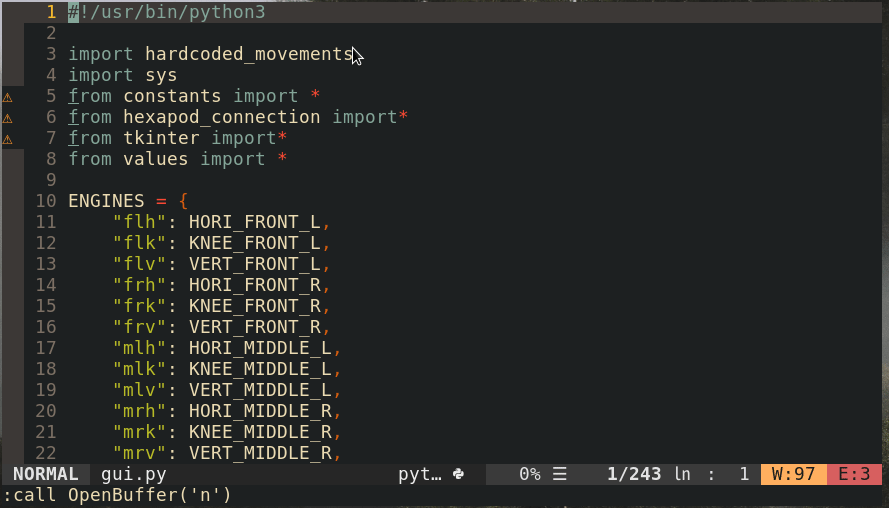

# Nvim-Switch-Buffer

Nvim-Switch-Buffer is a plugin to quickly switch beetween open buffers in neovim.\
It uses the floating window feature of neovim

Example: \


## Installation

### Using Plug
```
Plug 'Yohannfra/Nvim-Switch-Buffer'
```

### Manual installation
```
git clone https://github.com/Yohannfra/Nvim-Switch-Buffer/ ~/.vim/plugin/
```

## Configuration

Just add this line to your init.vim
```vim
" Feel free to map the shortcut you want
nnoremap S :SwitchBuffer <cr>
```

## How to use

- Navigate in the window using j/k or Up/Down
- Press Enter or Space to open the buffer
- Press s to open the buffer in a horizontal split
- Press v to open the buffer in a vertical split
- Press S or :q to close the window

## License

This project is licensed under the terms of the MIT license.
